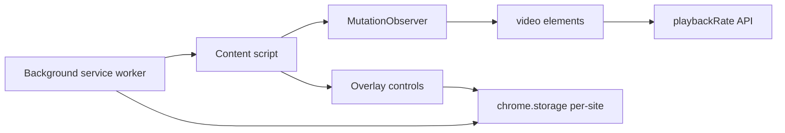

# Video Speed Controller

Chrome extension for fine-grained video playback speed across any site. 0.1× to 16× range, per-site memory, keyboard shortcuts. Works where native controls don't: YouTube, Netflix, Udemy, Coursera, generic HTML5.

- **Chrome Web Store:** https://chromewebstore.google.com/detail/video-speed-controller-pr/mahfenfglifhcipcpobblpgdaefigpee
- **Portfolio:** https://arjun-varma.com/

## Problem

Online learning has exploded, but video platforms cap speed options at 0.5×–2×. Power users want finer control — 1.25×, 1.75×, 3× for review, back down to 0.75× for dense lectures. Worse, many platforms reset speed between videos or don't remember preferences, creating friction.

## Challenge

- Different sites structure video players differently — native HTML5, custom wrappers, shadow DOM
- Some platforms actively reset `playbackRate` on video load or segment changes
- DRM-protected content may restrict speed modifications
- Must work across YouTube, Netflix, Coursera, Udemy, and arbitrary sites
- Keyboard shortcuts must not conflict with existing site hotkeys

## Approach

1. **Content script injection** — scripts locate all video elements on the page, including dynamically loaded ones
2. **MutationObserver pattern** — watch for new `<video>` elements entering the DOM and auto-apply speed settings
3. **Persistent storage** — Chrome's storage API remembers speed preferences per-site and globally
4. **Non-intrusive UI** — overlay controls appear on hover, don't disrupt viewing
5. **Keyboard shortcuts** — configurable hotkeys for quick speed adjustments during playback

## Solution / Architecture



**Components:**

- **Background service worker** — manages extension state and cross-tab communication
- **Content scripts** — injected into pages to control video elements and render the UI overlay
- **Options page** — configure default speed, keyboard shortcuts, per-site preferences
- **Speed memory** — automatically applies preferred speed to new videos without manual intervention

Implementation uses the standard `HTMLMediaElement.playbackRate` API with fallbacks for sites that try to override user settings.

## Impact / Results

- Works on YouTube, Netflix, Udemy, Coursera, and generic HTML5 videos
- Fine-grained speed from 0.1× to 16× in customizable increments
- Remembers preferences across sessions and sites
- Lightweight — negligible performance overhead
- Published on the Chrome Web Store, used daily as a personal tool

## Tech Stack

JavaScript · Chrome Extension MV3 · MutationObserver · chrome.storage API · HTML/CSS

## Run Locally / Load Unpacked

```bash
git clone https://github.com/ARJUNVARMA2000/Video-Speed-Controller-extension.git
```

1. Open `chrome://extensions`
2. Toggle **Developer mode**
3. Click **Load unpacked** and select the cloned directory
4. Navigate to any video site and try the speed controls

## License

MIT
