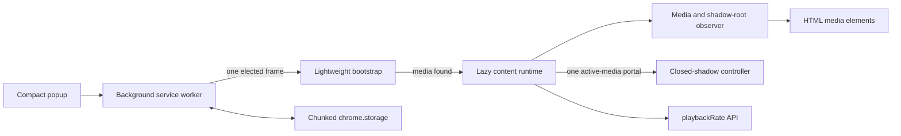

# Video Speed Controller

Chrome extension for fine-grained video playback speed across any site. 0.1× to 16× range, per-site memory, keyboard shortcuts. Works where native controls don't: YouTube, Netflix, Udemy, Coursera, generic HTML5.

- **Chrome Web Store:** https://chromewebstore.google.com/detail/video-speed-controller-pr/mahfenfglifhcipcpobblpgdaefigpee
- **Portfolio:** https://arjun-varma.com/

## Problem

Online learning has exploded, but video platforms cap speed options at 0.5×–2×. Power users want finer control — 1.25×, 1.75×, 3× for review, back down to 0.75× for dense lectures. Worse, many platforms reset speed between videos or don't remember preferences, creating friction.

## Challenge

- Different sites structure video players differently — native HTML5, custom wrappers, shadow DOM
- Some platforms actively reset `playbackRate` on video load or segment changes
- DRM-protected content may restrict speed modifications
- Must work across YouTube, Netflix, Coursera, Udemy, and arbitrary sites
- Keyboard shortcuts must not conflict with existing site hotkeys

## Approach

1. **Lazy content activation** — a byte-budgeted detector watches for media; the full runtime is parsed only after media exists
2. **MutationObserver pattern** — watch for new `<video>` elements entering the DOM and auto-apply speed settings
3. **Persistent storage** — Chrome's storage API remembers speed preferences per-site and globally
4. **One non-intrusive portal** — a fixed, closed-shadow controller follows the active player without changing page-owned DOM
5. **Keyboard shortcuts** — configurable key chords for quick speed adjustments during playback
6. **Defensive settings layer** — validates imports, chunks large synced collections, and safely merges concurrent updates

## Solution / Architecture


```mermaid
flowchart LR
    P[Compact popup] --> BG[Background service worker]
    BG -->|one elected frame| BS[Lightweight bootstrap]
    BS -->|media found| CS[Lazy content runtime]
    CS --> MO[Media and shadow-root observer]
    MO --> M[HTML media elements]
    CS -->|one active-media portal| UI[Closed-shadow controller]
    CS --> PR[playbackRate API]
    BG <--> ST[Chunked chrome.storage]
```

**Components:**

- **Background service worker** — manages state and routes each popup/command action to one ranked media frame
- **Content bootstrap** — detects light/open-shadow media in every frame without reading settings or parsing feature code
- **Lazy content runtime** — discovers media, arbitrates the active player, and batches local accounting only on media pages
- **Compact popup** — current-video play/pause, remaining time, presets, speed step, and time-saved status
- **Options page** — advanced behavior, appearance, shortcuts, site rules, and import/export
- **Speed memory** — resolves URL, site, and remembered speeds from one cached settings snapshot per frame

Implementation uses the standard `HTMLMediaElement.playbackRate` API with fallbacks for sites that try to override user settings.

## Impact / Results

- Works on YouTube, Netflix, Udemy, Coursera, and generic HTML5 videos
- Fine-grained speed from 0.1× to 16× in customizable increments
- Remembers preferences across sessions and sites
- One controller portal for any number of media elements in a frame; no video reparenting
- Published on the Chrome Web Store, used daily as a personal tool

## v1.6 Update

- Uses one fixed closed-shadow controller per frame, retargeted to the active player without wrapping or moving media.
- Routes commands and popup actions to one ranked frame, retrying only explicit frame IDs.
- Adds a compact popup and moves advanced controls to Chrome's dedicated options page.
- Adds custom presets, a global speed step, complete modifier chords, play/pause, and speed-adjusted remaining time.
- Adds opt-in silence skipping with local amplitude analysis, configurable threshold/duration/speed, and a shared audio graph.
- Batches time-saved writes for 30 seconds and resolves per-site behavior from a cached settings snapshot.
- Splits large synced collections under Chrome Sync item quotas and migrates the legacy storage shape.
- Ships complete English, Spanish, Brazilian Portuguese, French, German, and Japanese catalogues.
- Adds a loaded-extension Chromium suite covering hostile CSS, 42-media stress, open shadow roots, frames, popup routing, storage, cleanup, and YouTube smoke testing.

## v1.7 Performance and Test Update

- Replaces the always-injected 116KB feature runtime with a 7.6KB bootstrap and parallel lazy modules. Empty pages never parse the controller runtime or read settings.
- Caches one normalized Sync snapshot per service-worker lifetime, patches external scalar changes in place, and keeps local time-saved statistics out of content-frame startup.
- Writes only changed Sync collection chunks; saving one site speed no longer resubmits unrelated rules and settings.
- Reuses short-lived media geometry snapshots, coalesces media arbitration, shares one resize observer, and avoids rebuilding unchanged controller HTML.
- Replaces one-second all-media time-saved polling with event/lifecycle accrual and a 30-second persistence boundary.
- Adds directly tested content ranking, visibility, enforcement, silence, and accounting logic; the automated suite now covers lazy-load races, disabled/blocked activation, audio-only pages, worker caching, write amplification, and context invalidation.
- Adds `npm run benchmark` for repeatable empty-page, 20-frame, first-media, and 40-media measurements.

## Tech Stack

JavaScript · Chrome Extension MV3 · MutationObserver · chrome.storage API · HTML/CSS

## Run Locally / Load Unpacked

```bash
git clone https://github.com/ARJUNVARMA2000/Video-Speed-Controller-extension.git
```

1. Open `chrome://extensions`
2. Toggle **Developer mode**
3. Click **Load unpacked** and select the cloned directory
4. Navigate to any video site and try the speed controls

If the extension was loaded while a video page was already open, reload that page once so Chrome can inject the content script.

## Development and Testing

Node.js 20 or newer is required for the browser test dependency.

```bash
npm install
npx playwright install chromium
npm test
npm run check
npm run check:full
npm run test:e2e
npm run test:coverage
npm run benchmark
npm run test:manual
```

Set `VSC_REAL_SITE_SMOKE=1` when running `npm run test:e2e` to include the opt-in YouTube smoke check.
`npm run check:full` runs the fast checks and the local unpacked-extension browser suite.

The manual test lab is served at `http://127.0.0.1:4173/media.html`. See [`docs/TESTING.md`](docs/TESTING.md) for the Chrome smoke-test checklist.

Create the exact ZIP used for a store upload with:

```bash
npm run package
```

The release artifact is written to `dist/video-speed-controller-v<version>.zip`. Development files and tests are excluded.
Store copy and the five-shot image brief live in [`docs/STORE_LISTING.md`](docs/STORE_LISTING.md).

## Keyboard Shortcuts

Defaults; all of them are remappable from the popup.

| Key | Action |
| --- | --- |
| `V` | Show/hide the controller |
| `S` / `D` | Decrease / increase speed by 0.1x |
| `R` | Reset to 1x |
| `Z` / `X` | Rewind / advance 10 seconds |
| `G` | **Hold to boost** — speeds up while held, restores on release |
| `,` / `.` | Previous / next frame |
| `P` | Screenshot the current frame |
| `[` / `]` | Set A-B loop points |
| `\` | Clear the A-B loop |

`G` is a press-and-hold control rather than a toggle: it applies the configured speed for as
long as the key is down and restores the previous speed when released.

Shortcuts can include any exact combination of Control, Alt, Shift, and Meta. The options page
rejects duplicate chords and common browser-reserved combinations.

## Settings schema additions in v1.6

| Setting | Default | Valid range / shape |
| --- | --- | --- |
| `speedStep` | `0.1` | 0.05–2.0 |
| `speedPresets` | `0.5, 0.75, 1, 1.25, 1.5, 2, 3` | 1–12 unique speeds, each 0.1–16 |
| `silenceSkipEnabled` | `false` | Boolean |
| `silenceThreshold` | `0.02` | RMS amplitude 0.001–0.2 |
| `silenceMinDuration` | `1` | 0.2–10 seconds |
| `silenceSkipSpeed` | `4` | 1.5–16 |

Large site/rule maps are stored as internal `__vscChunk:*` items. Import/export continues to use
the original public settings shape; callers do not need to understand the chunk format.

## Site and URL Patterns

- Plain text, such as `youtube.com`, performs a case-insensitive substring match.
- `*` is a wildcard, such as `*.example.com/watch/*`.
- Regular expressions must be explicit, such as `/example\\.com\\/watch\\/\\d+/`.

The first matching URL speed rule wins.

## Browser Support

Chrome and Chromium-based browsers (Edge, Brave, Arc). **Firefox is not supported.** Firefox
does not implement `background.service_worker`, so the extension's entire background layer --
settings storage, message handling, and commands -- would be absent there. Supporting it needs
an event-page background script rather than a manifest tweak.

## Known Limitations

- Canvas- or WebGL-rendered players without an HTML `<video>` or `<audio>` element cannot be controlled.
- Media inside a closed shadow root cannot be reached. Open shadow roots, including nested ones and roots that receive media after page load, are supported.
- Some DRM-protected media and live streams may reject non-standard playback rates.
- Silence skipping is unavailable for protected media and remote media that cannot be safely analysed; it turns itself off without changing the user's selected speed.
- Screenshot capture can be blocked when a remote video does not permit canvas access.

## License

MIT
