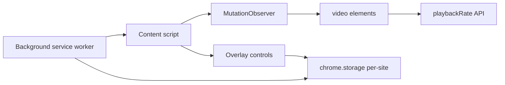

# Video Speed Controller

Chrome extension for fine-grained video playback speed across any site. 0.1× to 16× range, per-site memory, keyboard shortcuts. Works where native controls don't: YouTube, Netflix, Udemy, Coursera, generic HTML5.

- **Chrome Web Store:** https://chromewebstore.google.com/detail/video-speed-controller-pr/mahfenfglifhcipcpobblpgdaefigpee
- **Portfolio:** https://arjun-varma.com/

## Problem

Online learning has exploded, but video platforms cap speed options at 0.5×–2×. Power users want finer control — 1.25×, 1.75×, 3× for review, back down to 0.75× for dense lectures. Worse, many platforms reset speed between videos or don't remember preferences, creating friction.

## Challenge

- Different sites structure video players differently — native HTML5, custom wrappers, shadow DOM
- Some platforms actively reset `playbackRate` on video load or segment changes
- DRM-protected content may restrict speed modifications
- Must work across YouTube, Netflix, Coursera, Udemy, and arbitrary sites
- Keyboard shortcuts must not conflict with existing site hotkeys

## Approach

1. **Content script injection** — scripts locate all video elements on the page, including dynamically loaded ones
2. **MutationObserver pattern** — watch for new `<video>` elements entering the DOM and auto-apply speed settings
3. **Persistent storage** — Chrome's storage API remembers speed preferences per-site and globally
4. **Non-intrusive UI** — overlay controls appear on hover, don't disrupt viewing
5. **Keyboard shortcuts** — configurable hotkeys for quick speed adjustments during playback
6. **Defensive settings layer** — validates imported values and safely merges concurrent per-site updates

## Solution / Architecture


```mermaid
flowchart LR
    BG[Background service worker] --> CS[Content script]
    CS --> MO[MutationObserver]
    MO --> V[video elements]
    V --> PR[playbackRate API]
    CS --> UI[Overlay controls]
    BG --> ST[chrome.storage per-site]
    UI --> ST
```

**Components:**

- **Background service worker** — manages extension state and cross-tab communication
- **Content scripts** — injected into pages to control video elements and render the UI overlay
- **Popup** — control the current video's speed and configure shortcuts, appearance, access, and per-site preferences
- **Speed memory** — automatically applies preferred speed to new videos without manual intervention

Implementation uses the standard `HTMLMediaElement.playbackRate` API with fallbacks for sites that try to override user settings.

## Impact / Results

- Works on YouTube, Netflix, Udemy, Coursera, and generic HTML5 videos
- Fine-grained speed from 0.1× to 16× in customizable increments
- Remembers preferences across sessions and sites
- Lightweight — negligible performance overhead
- Published on the Chrome Web Store, used daily as a personal tool

## v1.4 Reliability Update

- Adds current-site and active-speed feedback to the popup
- Prevents stale popup snapshots from overwriting per-site speed data
- Validates imported settings and clamps unsafe numeric values
- Serializes frequent per-site storage writes so updates are not dropped
- Tracks time saved once per second only while media is playing
- Cleans up observers, timers, loop handlers, and media state when elements disappear
- Adds automated settings and service-worker regression tests
- Adds a deterministic local HTML5 media test lab and reproducible release packaging

## Tech Stack

JavaScript · Chrome Extension MV3 · MutationObserver · chrome.storage API · HTML/CSS

## Run Locally / Load Unpacked

```bash
git clone https://github.com/ARJUNVARMA2000/Video-Speed-Controller-extension.git
```

1. Open `chrome://extensions`
2. Toggle **Developer mode**
3. Click **Load unpacked** and select the cloned directory
4. Navigate to any video site and try the speed controls

If the extension was loaded while a video page was already open, reload that page once so Chrome can inject the content script.

## Development and Testing

Node.js 18 or newer is sufficient; the test suite has no third-party dependencies.

```bash
npm test
npm run check
npm run test:manual
```

The manual test lab is served at `http://127.0.0.1:4173/media.html`. See [`docs/TESTING.md`](docs/TESTING.md) for the Chrome smoke-test checklist.

Create the exact ZIP used for a store upload with:

```bash
npm run package
```

The release artifact is written to `dist/video-speed-controller-v<version>.zip`. Development files and tests are excluded.

## Keyboard Shortcuts

Defaults; all of them are remappable from the popup.

| Key | Action |
| --- | --- |
| `V` | Show/hide the controller |
| `S` / `D` | Decrease / increase speed by 0.1x |
| `R` | Reset to 1x |
| `Z` / `X` | Rewind / advance 10 seconds |
| `G` | **Hold to boost** — speeds up while held, restores on release |
| `,` / `.` | Previous / next frame |
| `P` | Screenshot the current frame |
| `[` / `]` | Set A-B loop points |
| `\` | Clear the A-B loop |

`G` is a press-and-hold control rather than a toggle: it applies the configured speed for as
long as the key is down and restores the previous speed when released.

## Site and URL Patterns

- Plain text, such as `youtube.com`, performs a case-insensitive substring match.
- `*` is a wildcard, such as `*.example.com/watch/*`.
- Regular expressions must be explicit, such as `/example\\.com\\/watch\\/\\d+/`.

The first matching URL speed rule wins.

## Browser Support

Chrome and Chromium-based browsers (Edge, Brave, Arc). **Firefox is not supported.** Firefox
does not implement `background.service_worker`, so the extension's entire background layer --
settings storage, message handling, and commands -- would be absent there. Supporting it needs
an event-page background script rather than a manifest tweak.

## Known Limitations

- Canvas- or WebGL-rendered players without an HTML `<video>` or `<audio>` element cannot be controlled.
- Media inside a closed shadow root cannot be reached. Open shadow roots, including nested ones and roots that receive media after page load, are supported.
- Some DRM-protected media and live streams may reject non-standard playback rates.
- Screenshot capture can be blocked when a remote video does not permit canvas access.

## License

MIT
